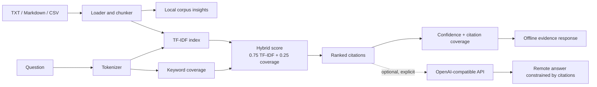

# Doc Analyst | Local Evidence Workspace

> **本地文档智能工作台**：为 TXT、Markdown 与 CSV 提供确定性混合检索、可回溯引用、回答质量信号和数据洞察。默认离线运行；它不是 LLM，也不会在离线模式假装生成答案。

[](https://www.python.org/)
[](https://streamlit.io/)
[](#testing)
[](#boundaries)

## Why it exists

Local documents are often small enough that a transparent retrieval workflow is more useful than an opaque chat interface. Doc Analyst makes the evidence path visible:

- **Hybrid retrieval**: combines TF-IDF semantic lexical similarity with query-keyword coverage.
- **Traceable evidence**: every hit retains a file name plus approximate text line or exact CSV row locator.
- **Quality signals**: answers expose `grounded`, `low_evidence`, or `no_evidence`, together with confidence and citation coverage.
- **Corpus insights**: file/chunk counts, frequent tokens, and discovered numeric values are available before asking a question.
- **CSV-ready**: previews numeric summaries, date-like fields, and row-level citations.
- **Offline by default**: no document content leaves the machine unless an operator explicitly enables a compatible remote model.

## Architecture



## Trustworthy Retrieval

The local answer path is deterministic retrieval, not language-model generation:

1. The index tokenizes documents and the query with the same tokenizer.
2. TF-IDF cosine similarity measures lexical relevance per chunk.
3. Keyword coverage measures how many unique query terms occur in that chunk.
4. The final score is `0.75 * tfidf_score + 0.25 * keyword_score`.
5. Results below the minimum score are excluded; remaining chunks become numbered citations.

`confidence` is the best retrieved hybrid score, not a calibrated probability or a claim that an answer is true. `citation coverage` is the fraction of unique query terms present across returned citations. Quality status is deliberately conservative:

| Status | Meaning |
| --- | --- |
| `grounded` | At least one strong hit and at least 50% query-term coverage. |
| `low_evidence` | A result exists, but score or coverage is weak. Treat it as a lead, not a conclusion. |
| `no_evidence` | No chunk passed the retrieval threshold. The tool returns an explicit no-evidence response. |

The UI displays the hybrid score and its two components for every citation, so a user can inspect why a chunk ranked.

## Demo

The bundled `docs/` corpus contains a project overview and sales CSV.

| Query / action | Expected evidence |
| --- | --- |
| Ask `项目预算是多少？` | `100 万元人民币` from `company_overview.md`, with locator and component scores. |
| Ask `预算 完全不存在的词` | `low_evidence`, because only part of the query is supported. |
| Open **CSV 分析** and select `monthly_sales.csv` | 3 data rows, `revenue` sum `145`, plus numeric field statistics. |
| Open **语料洞察** | file and chunk counts, frequent tokens, and values such as `100` / `2024`. |

## Quick Start

```bash
python -m venv .venv
.venv\Scripts\activate  # Windows PowerShell / cmd
pip install -r requirements.txt
streamlit run app.py
```

Open the local URL printed by Streamlit. Upload `.txt`, `.md`, or `.csv` files from the sidebar, or use the included `docs/` examples.

### Programmatic use

```python
from logic import DocumentIndex, load_paths

index = DocumentIndex(load_paths(["docs/company_overview.md"]))
answer = index.ask("项目预算是多少？")

print(answer.text)
print(answer.quality_status, answer.confidence, answer.citation_coverage)
for hit in answer.citations:
    print(hit.chunk.source, hit.chunk.locator, hit.tfidf_score, hit.keyword_score)
```

## Optional Remote Model

A remote OpenAI-compatible `/chat/completions` provider is optional. Enable **启用远程模型** in the UI and provide an API key, or set `OPENAI_API_KEY`, `OPENAI_BASE_URL`, and `OPENAI_MODEL`.

Only the retrieved chunks and question are sent to that API. The prompt requires the remote model to use evidence numbering and say when evidence is insufficient. Remote output can still be wrong, incomplete, or fail to cite evidence correctly; inspect the displayed citations and quality signals.

## Privacy

- Default mode is fully local: indexing, scoring, insights, CSV analysis, and offline responses stay on the machine.
- Uploaded files are written to the local `.streamlit_uploads/` working directory for the current app process.
- No telemetry, embedding API, or remote model call is enabled by default.
- When the remote toggle is enabled, the question and retrieved context leave the machine. Do not enable it for data your configured provider must not receive.

## Testing

```bash
pytest -q
```

The test suite covers text and BOM CSV loading, locators, numeric CSV analysis, thresholds, structured summaries, unsupported file types, hybrid-score components, quality states, citation coverage, and corpus insights.

## Boundaries

- Supported input encodings are UTF-8 text and UTF-8 BOM CSV. PDF, DOCX, OCR, and scanned images are intentionally out of scope.
- Retrieval is lexical and deterministic. It does not understand unstated implications, perform reasoning over documents, or verify factual accuracy.
- The confidence value is a retrieval signal, not a statistical confidence interval or truth guarantee.
- The tool is not financial, legal, medical, security, or compliance advice.
- This repository uses an MIT-style project positioning; add a `LICENSE` file before claiming a formal license in distribution.

## Resume-ready Description

**English**: Built a local-first document intelligence workspace with deterministic TF-IDF plus keyword-coverage retrieval, citation-level score transparency, answer evidence states, corpus/CSV insights, and an explicitly opt-in OpenAI-compatible provider.

**中文**：构建本地优先的文档智能工作台，以 TF-IDF 与关键词覆盖率混合检索为核心，提供引用级分项评分、回答证据状态、语料与 CSV 洞察，并将远程 OpenAI-compatible 模型设计为明确的可选能力。
